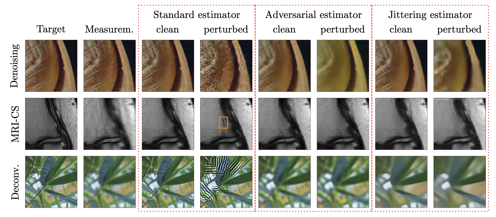

# Learning Provably Robust Estimators for Inverse Problems via Jittering

This repository provides code for reproducing the results of the main body in the paper:

**Learning Provably Robust Estimators for Inverse Problems via Jittering**, by Anselm Krainovic, Mahdi Soltanolkotabi and Reinhard Heckel

---
*Summary*: The paper investigates jittering, i.e. adding isotrope Gaussian noise during training, and demonstrates its effectivity for enhancing the worst-case robustness of network-based reconstruction methods for linear inverse problems. To that end, experiments are performed for the tasks of natural image denoising and deconvolution as well as reconstructing accelerated magnetic resonance imaging (MRI) data. For each task, neural networks (U-nets) are trained via standard training, jittering and adversarial training and evaluated on its reconstruction error under adversarial perturbations. Experimental details and findings as well as supporting theory are described in the [paper](https://arxiv.org/abs/2307.12822).



---

### List of contents

* [Setup and installation](#setup) 

* [Dataset](#datasets) 

* [Running the code](#running) 

* [Code references](#coderefs) 

* [Citations](#citations)

* [License](#license)
***

<a name="setup"></a>
# Setup and Installation

## OS and containerization

The code has been tested using the [pytorch/pytorch](https://hub.docker.com/r/pytorch/pytorch) docker image, with the docker service running on `Linux: Ubuntu 20.04 LTS`.

## Python dependencies

The requirements are defined in the `env.yml` file and consist of the following packages:
```
name: ipJit

channels:
  - pytorch
  - defaults

dependencies:
  - python=3.9
  - pytorch=1.12.0
  - pip
  - pip:
    - matplotlib
    - torchvision
    - tensorboard
    - ipywidgets
    - ipykernel
    - tikzplotlib
    - tqdm
    - torchsummary
    - scipy
    - fastmri
```


The dependencies can be setup as an `anaconda` environment by running:
```sh
    conda env create -f env.yml
    conda activate ipJit
```


<a name="datasets"></a>
# Datasets

The experiments are performed on the following datasets:
 - [FastMRI](https://fastmri.med.nyu.edu/) singlecoil knee. The dataset is open, however you need to apply for access at https://fastmri.med.nyu.edu/.
 - [ImageNet](https://www.image-net.org/). You can request access at https://image-net.org/download.php.
 
The paths to downloaded datasets (`train` and `validation` splits) need to set in the `experiments/*/configs/base_config.py` files, respectively.


<a name="running"></a>
# Running the code

The experiments can be performed using the `main.py` file, which provides a command-line interface. The syntax is:
```sh
python main.py [-e {mri,nat_img,subspace}] [-s STEPS] [-c CONFIGS] {run,list,clear,remove,tb,show}
```
The experiments, steps and configuration arguments are interpreted as regular expressions and are `".*"` by default. Only stating the command is required. As a simple example, all experiments can be performed with the following shell command:

```sh
python main.py run
```
Alternatively, one may apply filters using the regular expression to run only certain steps for an experiment. As an example, the following command runs all denoising experiments for natural images:
```sh
python main.py -e nat_img -c ".*denoising.*" run
```

The experiment (`-e`), step (`-s`) and configuration (`-c`) parameters refer to the structure of the code:

**Experiments**:
 - `natural_images`: Natural image gaussian denoising and deconvolution experiments.
 - `mri`: Compressive sensing for accelerated magnetic resonance imaging (MRI) experiments.
 - `subspace`: Linear reconstructions of signals lying in a subspace.

**Steps** for each experiment:
 - `preprocess`: Generates the training, validation and test splits.
 - `hpsearch`: Performs a grid search for the jittering hyperparameters.
 - `train`: Trains the models using adversarial training, standard training and jittering.
 - `eval`:  Evaluates the models on the configured dataset.
 - `visualize`: Generates example images comparing the different training methods visually.
 - `plot`: Plots the evaluation results to generate the main figures of the paper.

**Configurations** of each step. As an example, for each of the training, validation and test datasets, there exists a configuration in `experiments/natural_images/configs/preprocess_configs.py`. Each of these configurations is a specific parametrization of the more generic `preprocess_dataset` step method.

**Pipeline** (step dependencies):
 ```mermaid
 graph LR;
 preprocess-->|train & validation \n dataset| hpsearch;
 preprocess-->|train & validation \n dataset| train;
 hpsearch--->|jittering\n parameters| train;
 preprocess--->|test dataset| visualize;
 train--->|models| eval;
 preprocess--->|test dataset| eval;
 eval--->|results| plot; 
 train--->|models| visualize;
 ```
For the `mri` and `subspace`, the preprocess step does not actually need to be run explicitly. Moreover, for the `subspace` experiment, there is no `visualize` step.

**Listing**: The available experiments, corresponding steps and their configurations can be visualized via the `list` command:
```
python main.py -e nat_img -s preprocess -c ".*" list
```
which produces the following output:
```
Experiment: nat_img
 ├───Step: preprocess
 │   ├───Conf: preprocessing_config_train (finished)
 │   ├───Conf: preprocessing_config_val (finished)
 │   ├───Conf: preprocessing_config_test (finished)
 │   └───Conf: preprocessing_config_test_visual (finished)
```
The complete structure can be obtained by running
```
python main.py list
```

**Commands**:
There are multiple commands available. Each of these is applied to any configuration, which matches the regular expressions (e.g. when using `-c ".*_config_train"` only the train dataset is preprocessed). The commands available are:
 - `run`: Runs the step method with the parametrization as given by the configuration.
 - `remove`: Removes the artifacts generated by the steps (e.g. trained models or datasets)
 - `clear`: Removes all outputs generated by steps which failed to finish (see status in listing).
 - `tb`: Opens a tensorboard session with the log-dir set to the output directory of the configured step.
 - `list`: Prints the defined experiments, steps and configuration (see above).
 - `show`: Prints the files found in the steps artifact output directory.

<a name="coderefs"></a>
# Code references
Code for training the U-net and handling the MRI datasets is adapted from the [fastMRI repository](https://github.com/facebookresearch/fastMRI). Code for the U-net model for natural images is adapted from [segmentation-models-pytorch](https://github.com/qubvel/segmentation_models.pytorch) package, see also this [blog post](https://amaarora.github.io/posts/2020-09-13-unet.html) (accessed: 07/2023).

Code for finding adversarial examples is adapted from the [robustness](https://pypi.org/project/robustness/) package.

<a name="citations"></a>
# Citation
If you use this repository, please cite the paper:
```bibtex
@article{krainovic_inverseProblemsJittering_2023,
    author = {Anselm Krainovic and Mahdi Soltanolkotabi and Reinhard Heckel},
    title = {Learning Provably Robust Estimators for Inverse Problems via Jittering},
    journal = {arxiv:2307.12822},
    year = {2023}
}
```

<a name="license"></a>
# License
This project is covered by **Apache 2.0 License**.